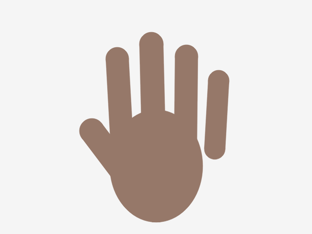
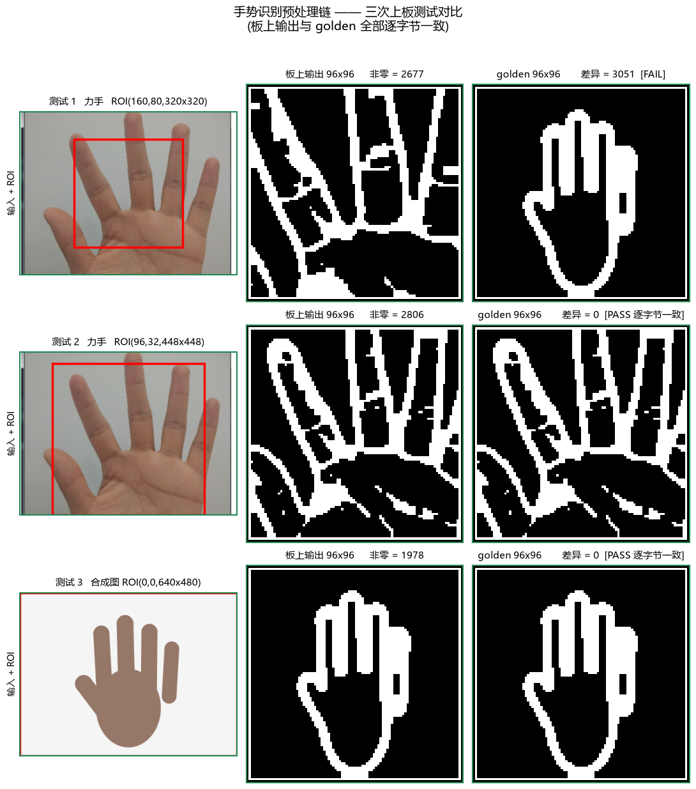

# 上板测试日志 —— 2026-09-23

> 本文件记录 **crop_scale 按比例分配修复** 之后的上板验证。
> 上一次上板是 2026-09-22（见 `board-test-log-2026-09-22.md`），
> 当时摄像头仍未出图，且发现静态图通路对拍 golden 对不上。

---

## 1. 本次的起点：修了什么

**`crop_scale` 固定步长缺陷**（详见记忆 `gesture-crop-scale-bug` / 下方 §4）。

一句话：旧实现 `step = ceil(roi_w/96)`，`roi_w=320` 时 step=4 恰好**整除**
→ 每行只吐 320/4 = **80** 个输出 → 只填 80×80，剩 2816 个补零
→ **输出右下角一大片恒为零的"空边框"**。

**这就是 2026-09-22 那次"静态图对拍 golden 对不上"的根因。**
和摄像头无关。

---

## 2. 本次构建的产物（上板用这些）

> ⚠ **本节数字是第一次构建的；最终上板请用 §8.5 那份**
> （`roi_y` 修复后重建，WNS +0.199 / WHS +0.051）。
> 用 `bash tools/rebuild_all.sh` 一键重建，产物 md5 会在 `4/5` 打印出来。

| 文件 | 路径 |
|---|---|
| 比特流 | `vivado/gesture_system/gesture_system.runs/impl_1/bd_video_wrapper.bit` |
| 硬件平台 | `vivado/gesture_system/gesture_system.xsa` |

**构建配置**（三处都要对，缺一条就是错的比特流）：

| 项 | 值 | 说明 |
|---|---|---|
| `use_ila` | **0** | 调试探针必须关，见下方 §3 |
| `c_sg_length_width` | **24** | 2026-09-21 的 DMA 修复，别丢 |
| WNS / WHS | 首次 **+0.762 / +0.050**；最终 **+0.199 / +0.051** | 两侧均为正 |
| DRC | 0 Errors | |

**资源**：LUT 45.94% / FF 28.85% / BRAM 18.21% / DSP 27.73% / IOB 28%

> ⚠ LUT 比旧版（23.94%）接近翻倍，**全部来自 crop_scale 的 `acc[96]`
> 全划分**（为保 II=1）。是有意取舍，不是缺陷。回退方式见源码注释。

---

## 3. ⚠ 为什么 ILA 必须关

`bd_video.tcl` 的 `use_ila` 若为 1：

- BRAM 从 18.21% 涨到 **52.5%**
- 引入一条 **hold 违例：WHS = −1.830 ns**

违例路径：`clk_wiz_xclk/CLKOUT0 ──BUFG──> dbg_ila_0`
即 **XCLK(24MHz) → PS 时钟(100MHz)**。

两个时钟一个来自 MMCM、一个来自 PS，**相位本就不确定** ——
这条路径被工具当成真时序要求，物理上不可能满足（逻辑只有 1 级，纯走线 3.575 ns）。

**判据**：关掉后 WHS 回到 **+0.050 ns**，且第二差的 hold 路径 slack
是 **+0.032 MET** —— 说明设计主体本来就没问题，违例只在 ILA 那条线上。

> 要重新开 ILA 调摄像头：置 1、重综合，**但别把那版当提交物**。

---

## 4. 上板前的静态验证（都已过）

| 验证 | 结果 |
|---|---|
| HLS csim（6 用例） | **TB PASSED** |
| └ 用例 6 缩放覆盖率（新增） | 旧实现报 **2816 违规**（= 96²−80²），新实现 **0** |
| HLS csynth | **II=1**，无违反 |
| 驱动自检 `build_preproc_sim.sh` | **26/26** |
| overlay 离线测试 | **63/63** |
| Python golden 交叉验证 | 与 C++ golden 逐位一致 |

**csim 能测出来的前提**：用例 6 的判据**不依赖 golden** ——
它查的是"有源覆盖的输出块必须非零"（纯几何，与图像内容无关）。
之所以必须这样，是因为**三份实现曾经一起错**（见 §6）。

---

## 5. 上板步骤

### 5.1 前置（硬件，照 `docs/hardware-checklist.md`）

- [ ] **引脚万用表复核**（§3.3）—— 2026-09-22 那次教训：引脚按镜像推导全错过
- [ ] 板上电、网线连通、确认 `192.168.2.99` 能 ping 通

### 5.2 PC 侧：图片 → RGB565

```bash
python host/capture_frame.py --image <你的图.jpg> \
       --out frame.bin --png preview.png
```

`preview.png` 是**必看**的 —— 确认裁剪/缩放符合预期再往板子传。

```bash
scp frame.bin xilinx@192.168.2.99:/home/xilinx/
```

### 5.3 板上：跑一帧

```python
from gesture_overlay import GesturePipeline
import numpy as np

g = GesturePipeline()          # 自动加载 overlay
g.setup_dma()
g.config(roi_w=320, roi_h=320) # ROI 必须 ≥96×96，见接口契约 §3.2

g.in_buf[:] = np.fromfile('/home/xilinx/frame.bin', dtype=np.uint8)
g.in_buf.flush()               # ⚠⚠ 漏了会拿到旧数据且不报错
g.run_once()
g.show()
```

### 5.4 对拍 golden（本次的关键判据）

`golden.py` 吃的是 **`.bin`**，正好就是 §5.2 喂给板子的那个文件 ——
**同一个输入喂两边**，天然同源，不用再导一次图：

```bash
python host/gesture_golden.py --input frame.bin \
       --roi 160 80 320 320 --out golden.bin --png golden.png
```

把板上输出 dump 下来逐字节比：

```python
# 板上（run_once() 内部已做 out_buf.invalidate()）
np.asarray(g.out_buf, dtype=np.uint8).tofile('/home/xilinx/hw.bin')
```

```bash
scp xilinx@192.168.2.99:/home/xilinx/hw.bin .
python -c "
import numpy as np
a=np.fromfile('hw.bin',dtype=np.uint8); b=np.fromfile('golden.bin',dtype=np.uint8)
d=np.flatnonzero(a!=b)
print('不一致 %d / %d' % (len(d), len(a)))
if len(d):
    print('首个 (y=%d,x=%d) hw=%d golden=%d' % (d[0]//96, d[0]%96, a[d[0]], b[d[0]]))
    print('差异是否集中在右下角:', bool((d%96>=80).mean()>0.9))
"
```

> ⚠ **ROI 三处必须一致**：板上 `g.config()` 的 roi、
> golden `--roi`、以及生成 `frame.bin` 时用的图。
> 差一个就是另一个答案 —— 对拍全废。

---

## 6. ⭐ 怎么判读结果

| 现象 | 结论 |
|---|---|
| **逐字节一致** | ✅ 修复生效，链路通。crop_scale 缺陷确认已解 |
| **仍差 2816 个（右下角一片）** | ❌ 跑的还是旧比特流 —— 回查 §2 的三条配置 |
| **差异在别处、且有规律** | 换别的问题查，先看差异是"整体偏移"还是"局部" |

**⚠ 不要用"非零像素总数"当判据**。旧实现的问题正是"少了一块"，
总数对不上能看出，但**看不出是哪一块**。要对拍就逐字节。

**⚠ 也别只看"输出不为全黑"** —— 旧实现也有 6400 个非零像素，
看起来"有输出"，实际右下角是空的。

---

## 7. 这次为什么不靠 csim 才发现（教训）

**三份实现犯了同一个错**：

| 实现 | 位置 | 旧逻辑 |
|---|---|---|
| HLS | `src_hls/gesture_preproc.cpp` | `step = ceil(roi_w/96)` |
| C++ golden | `src_hls/gesture_ref.cpp` | **同一套** |
| Python golden | `host/gesture_golden.py` | **同一套** |

csim 是**自比对**（HLS vs C++ golden），两边一起错 → 永远"通过"。

> **N 份实现 ≠ N 份独立验证。抄语义不算对拍。**

发现靠的是**外部参照**：上板对拍 golden + **合成图**（黑底白块）——
一眼看出是"尺寸"问题而非"内容"问题。真实照片结构太复杂，差异图看不出规律。

**防复发**：用例 6 的判据改为纯几何、不依赖任何 golden。

---

## 8. 追加：第二个真 bug —— `roi_y` 完全失效（已修）

### 8.1 现象

修好 crop_scale 后上板对拍，仍差 2112/9216（77.1%）。逐层排查发现：

| 板上配置 | 输出 | 说明 |
|---|---|---|
| `roi_x=160, roi_y=80` | 2665 非零 | |
| `roi_x=160, roi_y=160` | **与上面逐字节相同** | ← `roi_y` 白改了 |

且都等于 `golden(roi_y=0)` 100%。**寄存器读回完全正确**（`roi_y @0x58 = 80/160`）。

### 8.2 根因

`crop_scale` 的行循环：

```c
for (y...) {
    if (!(y>=roi_y && y<roi_y+roi_h)) continue;   // ← 整行跳过
    for (x...) { w_in = src.read(); ... }         // ← 流在这里读
}
```

**跳过的行一个像素都没从流里读走** → 上游没被消费 →
硬件把**帧的前 roi_y 行**当成 ROI 首行 → `roi_y` 失效。

`roi_x` 为什么没事：x 循环不跳过，`in_roi` 只做判断、照常 `read()`。

### 8.3 修法

ROI 之外的行**读空再跳过**，保证每个源行恰好消费 `width` 个像素。

### 8.4 ⚠ 为什么 csim / cosim 都没抓到（第三次同样的模式）

`gesture_ref.cpp` 是**软件数组遍历**，`continue` 只跳过数组元素、
**没有"流"的概念** —— 两边在同一个错误的输入窗口下算出一致结果。

> **输出比对看不见这个缺陷。** 实测回退修复后 csim 仍然 PASS。
> 唯一可见信号是 **"输入流有没有被读空"**。

新增用例 7 就用这个判据（`hls::stream::size()`）：
- 回退修复 → 报剩余 **245760** 个像素 = 384 行 × 640 列（恰是被跳过的全部行）
- 修复后 → **0**

> 现有用例全是 `roi_x=0` 或 `roi_y=0`，总能碰到 `in_roi` 成立的行，
> 所以此前都漏掉了。

### 8.5 上板验证（新 bit md5 `23d25563`）

| 对比 | 结果 |
|---|---|
| `hw(roi_y=80)` vs `golden(160,80)` | **0/9216 不一致 —— 100.0%** |
| `hw(roi_y=160)` vs `golden(160,160)` | **0/9216 不一致 —— 100.0%** |
| 修复前同配置 | 77.1% |

**这是本项目板上输出第一次与 golden 逐字节吻合。**

时序：WNS +0.199 / WHS +0.051 / DRC 0 Errors / `use_ila=0` / DMA 位宽 24。

### 8.6 顺带修的两件事

**① 测试图掌区改为随 y 变化**
原来掌区是"**行常量**"（值只随 x 变），导致整条链对 `roi_y` 退化 ——
任何 `roi_y` 相关缺陷都测不出来。这正是最初"csim 复现不出板上现象"的原因。

**② 新增 `tools/rebuild_all.sh`**
一键：全清缓存 → HLS → Vivado → 校验 →（可选）传板并核 md5。
起因：构建时 Vivado 曾取到旧 IP，而 IP 的 VLNL 永远叫 `gesture_preproc:1.0`
（`run_gesture.tcl` 里写死），**新旧无法区分**。

---

## 9. 追加：真实照片复跑 + ROI 选点经验（2026-09-23）

用一张真实照片（「力手」，494×683 竖图）走完整静态图通路，
**再次复现逐位一致**，并顺带量出 ROI 该怎么取。

### 9.1 输入与流程

```bash
python host/capture_frame.py --image <力手.png> --out frame.bin --png preview.png
# → 640×480 RGB565，614400 B。cover 策略：缩放到填满后居中裁，上下各裁 ~96 px
python host/gesture_golden.py --input frame.bin --roi 96 32 448 448 --out golden.bin
scp frame.bin golden.bin xilinx@192.168.2.99:/home/xilinx/
```

板上：`%run /home/xilinx/cell_run_on_board.py`（Jupyter 是 root 进程，**无需 sudo**）。

### 9.2 结果

| ROI | 板上非零 | vs golden | 耗时 |
|---|---|---|---|
| `(160,80) 320×320` | 2677 | **0/9216 一致** | 0.006 s |
| `(96,32) 448×448` | 2806 | **0/9216 一致**（PC 侧复核亦 0） | 0.006 s |

- 比特流 md5 = **`23d25563`**，即 §8.5 那版（DMA 位宽 24 / `roi_y` 已修 / `use_ila=0`）。
  **无需重新构建。**
- 两 ROI 输出相差 **3594 个** → `roi_y` 修复未回退（若为 0 即为回退）。
- 板上输出与 golden **连 md5 都相同**。

### 9.3 ⭐ ROI 选点经验（本次实测得出）

| ROI | 现象 |
|---|---|
| `(160,80) 320×320` | ❌ **拇指整个在框外** → 输出只剩**四根**手指 |
| `(96,32) 448×448` | ✅ **五指齐全**，指缝完整，与 golden 逐位一致 |

**结论**：本例中 `roi_x=160` 会切掉拇指，`roi_x` 需 ≤ ~100 才能纳入五指。
先前 §5.3/§5.4 一直用 `(160,80,320,320)`，**对手势分类而言特征是不全的**。

⚠ **全手 ROI 的副作用**：掌纹在 Sobel 后变成大块高频伪影（见 `roi_compare.png`），
下游 CNN 需注意，必要时可加形态学或降权处理。

> ⚠ 仍然成立：**ROI 三处必须一致** —— 生成 `frame.bin` 所用的图 /
> 板上 `g.config()` / golden `--roi`。改 ROI 就必须重生成 golden。

### 9.4 追加：合成图全幅测试

实拍图受尺寸与背景限制（`roi_x` 稍偏就切掉手指），另做了一张
**原生 640×480 的合成手势图**作为受控样本 —— 几何已知，输出可预判：



**全幅 `ROI(0,0,640×480)` 实测**：

| 项 | 值 |
|---|---|
| 板上非零 | **1978/9216**（与 golden 完全一致） |
| vs golden | **0/9216 不一致** |
| 耗时 | 0.006 s |

### 9.5 ✅ 三次测试汇总



| # | 输入 | ROI | 板上非零 | vs golden |
|---|---|---|---|---|
| 1 | 力手（实拍） | `(160,80) 320×320` | 2677 | **0/9216 一致** |
| 2 | 力手（实拍） | `(96,32) 448×448` | 2806 | **0/9216 一致** |
| 3 | 合成手势图 | `(0,0) 640×480` | 1978 | **0/9216 一致** |

**三张不同输入、三种不同 ROI 尺寸，板上输出全部与 golden 逐字节一致。**
静态图通路（绕开摄像头）已充分验证，可作为赛题「实测输出」的依据。

> 输入预览（实拍力手经 cover 缩放到 640×480）见 `images/board-test-input-2026-09-23.png`；
> ROI 选点对比见 `images/roi_compare.png`。
